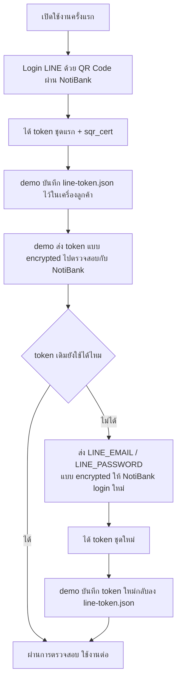

# PromptPay Client Demo

Demo client สำหรับทดสอบสร้าง PromptPay QR ผ่าน NotiBank API และรับ webhook event กลับมาที่หน้าเว็บ

## การตั้งค่า

ต้องมี:

- Node.js 18+
- NotiBank API ที่ใช้งานได้
- ผู้ใช้ใน NotiBank ตั้งค่า PromptPay ID แล้ว
- API key 1 ชุดจากหน้า API Keys ของ NotiBank

สร้างไฟล์ config:

```bash
cp .env.example .env
```

ตั้งค่า `.env`:

```bash
API_BASE=http://localhost:3001
PORT=3002
API_KEY=sk_line_your_key_here
WEBHOOK_SECRET=your_same_api_key_webhook_secret_here
LINE_TOKEN_FILE=./secrets/line-token.json
LINE_EMAIL=your-line-email@example.com
LINE_PASSWORD=your-line-password
```

แนวคิดของ demo ตอนนี้คือใช้ API key เดียวสำหรับทั้ง:

- สร้าง PromptPay transaction
- auth การอัปโหลด LINE Connector
- verify webhook ที่ NotiBank ส่งกลับมา

ดังนั้น `WEBHOOK_SECRET` ควรเป็น secret ของ API key เดียวกันนั้น

LINE Connector flow ปัจจุบันเป็นแบบนี้:



LINE Connector มี 3 flow หลัก:

- ถ้ามี `LINE_TOKEN_FILE` และมี `LINE_EMAIL` / `LINE_PASSWORD` demo จะส่ง token เดิมไปตรวจสอบก่อน และแนบ credential แบบ encrypted เป็น fallback
- ถ้ามีแต่ `LINE_TOKEN_FILE` demo จะอัปโหลด token แบบ encrypted เพื่อตรวจสอบอย่างเดียว
- ถ้าไม่มี token file แต่มี credential demo จะส่ง `email/password` แบบ encrypted ให้ NotiBank login เพื่อสร้าง token ชุดใหม่

ยังต้องทำ QR login จากหน้า NotiBank อย่างน้อยหนึ่งครั้งเพื่อสร้าง `sqr_cert` ของ user นั้นก่อน เพราะ certificate นี้ช่วยให้การ login fallback ด้วย email/password มีโอกาสผ่านได้โดยไม่ต้องยืนยัน PIN ใหม่ทุกครั้ง

ไฟล์ `LINE_TOKEN_FILE` สำหรับ fallback token upload ต้องเป็น JSON แบบนี้:

```json
{
  "authToken": "line-access-token",
  "refreshToken": "line-refresh-token",
  "mid": "u1234567890"
}
```

ติดตั้ง dependency:

```bash
npm install
```

## ใช้งานบนเครื่อง

เริ่ม server:

```bash
npm start
```

เปิดหน้าเว็บ:

```text
http://localhost:3002
```

เมื่อมีค่า config ครบ demo server จะ:

- อ่าน LINE token จากไฟล์ local ถ้ามี
- fetch public key จาก NotiBank
- เข้ารหัส payload แล้วส่งไป `POST /line/connector/token`
- ถ้า token เดิมใช้ไม่ได้ และมี `LINE_EMAIL` / `LINE_PASSWORD` ระบบจะ login ใหม่อัตโนมัติและบันทึก token ใหม่กลับลง `LINE_TOKEN_FILE`
- ใช้ `API_KEY` สำหรับ auth และใช้ `WEBHOOK_SECRET` ของ key เดียวกันสำหรับ HMAC/webhook verification
- retry ให้อัตโนมัติทุก 5 นาที
- เปิดให้กด manual retry จากหน้า demo

เหตุผลที่ยังต้องมี `LINE_EMAIL` / `LINE_PASSWORD`:

- `authToken` ของ LINE อาจหมดอายุหรือถูก revoke ได้
- ตอน token เดิมใช้ไม่ได้ demo จะไม่สามารถพึ่ง token file อย่างเดียวได้
- credential ชุดนี้จึงถูกใช้เป็น fallback เพื่อขอ token ใหม่เท่านั้น ไม่ใช่เส้นทางหลักของการทำงานประจำ

ตั้ง webhook URL ของ API key ใน NotiBank เป็น:

```text
http://localhost:3002/webhook
```

ถ้าใช้งานกับ production ให้ใช้ HTTPS public URL:

```text
https://your-demo-domain.example.com/webhook
```

## วิธีทดสอบ

1. เปิดหน้า demo
2. กรอกจำนวนเงิน
3. ใส่ `orderId` หรือเว้นว่างเพื่อให้ระบบสร้างให้อัตโนมัติ
4. กดสร้าง QR
5. สแกนจ่ายเงิน
6. ตรวจสถานะ QR, countdown และ webhook event บนหน้าเว็บ
